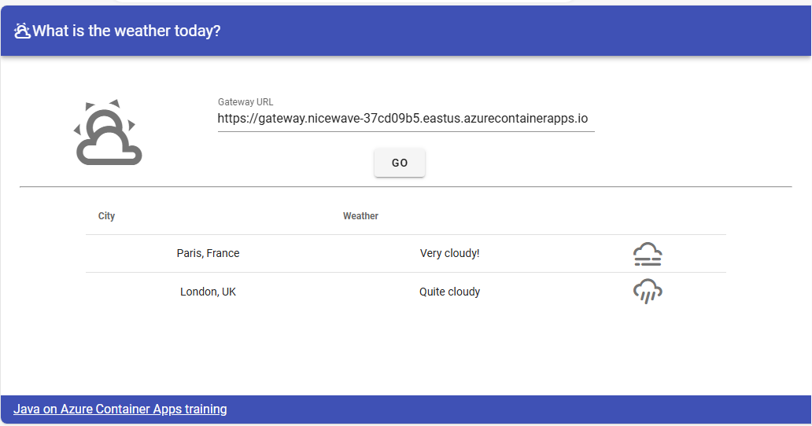

# 05 - Putting it all together, a complete microservice stack

__This guide is part of the [Build, Run and Monitor Intelligent Quarkus and Micronaut Java Apps on Azure Container Apps and Azure OpenAI](../README.md)__

Now that we have made microservices publicly available, we will incorporate a user interface to see them in action. Then, we will use Application Insights to monitor the flow of traffic to and among our services and to track metrics.

---

## Add a front-end to the microservices stack

We now have a complete microservices stack:

- A `gateway` based on NGINX Reverse Proxy.
- A reactive `city-service` microservice, that stores its data in Azure Database for PostgreSQL Flexible Server.
- A `weather-service` microservice, that stores its data in Azure Database for MySQL Flexible Server.

In order to finish this architecture, we need to add a front-end to it:

- We've already built a VueJS application, that is available in the [weather-app](weather-app/).
- This front-end will be hosted on Azure Container Apps as well, with its own domain name. That's why we enabled CORS in our gateway earlier.

## Build and deploy the application on Azure Container Apps

Similar to [Build and deploy Java application on Azure Container Apps](../01-build-a-simple-java-application/README.md#build-and-deploy-java-application-on-azure-container-apps), create a specific `weather-app` application in your Azure Container Apps.

```bash
# Build and push weather-app image to ACR
cd 05-putting-it-all-together-a-complete-microservice-stack

docker buildx build --platform linux/amd64 -f weather-app/Dockerfile -t weather-app ./weather-app
docker tag weather-app ${ACR_LOGIN_SERVER}/weather-app
docker login $ACR_LOGIN_SERVER \
    -u $ACR_USER_NAME \
    -p $ACR_PASSWORD
docker push ${ACR_LOGIN_SERVER}/weather-app

# Deploy weather-app to Azure Container Apps
az containerapp create \
    --resource-group $RESOURCE_GROUP_NAME \
    --name weather-app \
    --image ${ACR_LOGIN_SERVER}/weather-app \
    --environment $ACA_ENV \
    --registry-server $ACR_LOGIN_SERVER \
    --registry-username $ACR_USER_NAME \
    --registry-password $ACR_PASSWORD \
    --target-port 80 \
    --ingress 'external' \
    --min-replicas 1
cd ..
```

## Test the project in the cloud

Retrieve and output the URL of Azure Container Apps `weather-app`:

```bash
APP_URL=https://$(az containerapp show \
    --resource-group $RESOURCE_GROUP_NAME \
    --name weather-app \
    --query properties.configuration.ingress.fqdn \
    --output tsv)
echo "Weather app URL: $APP_URL"
```

Open the URL in a web browser, you should see a page where the "Gateway URL" is automatically populated with your gateway address. Click on "Go" and you should see the following screen:



## Run the project locally

Optionally, you can run the containerized VueJS application locally:

```bash
docker run -it --rm -e CONTAINER_APP_ENV_DNS_SUFFIX=${APP_URL#https://weather-app.} -p 8080:80 weather-app
```

> Note: the environment variable `CONTAINER_APP_ENV_DNS_SUFFIX` is the DNS suffix of the Azure Container Apps environment and is used to build the gateway URL. This variable is automatically set by Azure Container Apps and is injected into the container at runtime. We need to set it manually when running the container locally.

Open the URL http://localhost:8080 in a web browser, you should see a same page where the "Gateway URL" is automatically populated with your gateway address. Click on "Go" and you should see the same screen:


Switch back to the terminal and press `Ctrl+C` to stop the container.

## Monitor microservices with Application Insights

Now that we have a complete microservices stack running on Azure Container Apps, we can monitor the flow of traffic to and among our services and track metrics. We will use Azure Application Insights to do this.

Take note of the resource group name:

```bash
echo "Resource group name: $RESOURCE_GROUP_NAME"
```

Open the Azure Portal, navigate to the resource group, open the Application Insights resource you created, and open the following views to see the telemetry data collected by the OpenTelemetry agents from the microservices you deployed:

* Investigate > Application map
* Investigate > Transaction search
* Investigate > Failures
* Investigate > Performance
* Monitoring > Logs > traces
* Monitoring > Logs > requests

---

⬅️ Previous guide: [04 - Build a NGINX Reverse Proxy](../04-build-a-nginx-reverse-proxy/README.md)

➡️ Next guide: [06 - Build a Quarkus AI application using Azure OpenAI](../06-build-a-quarkus-ai-application-using-azure-openai/README.md)
