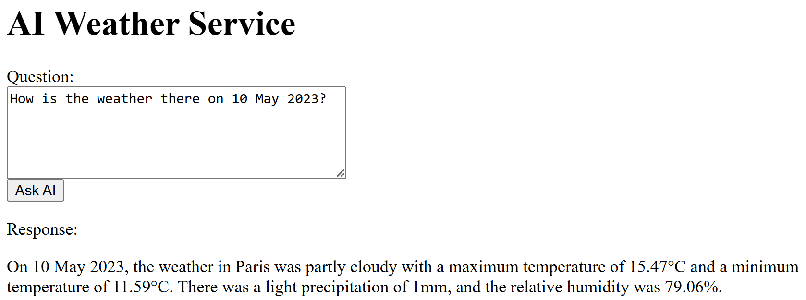
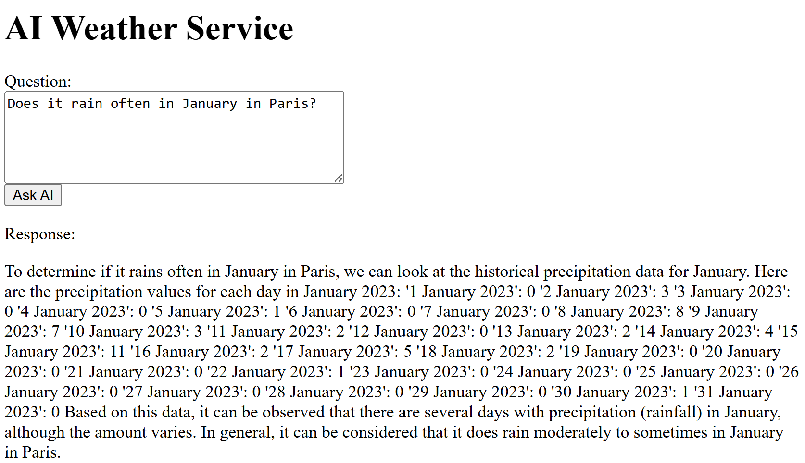
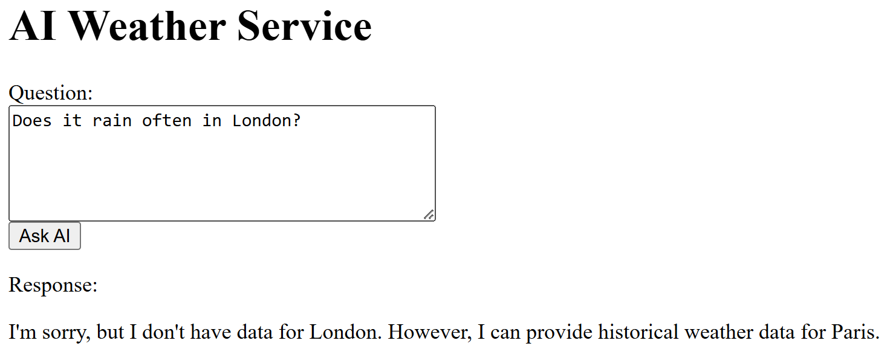

# 06 - Build a Quarkus AI application using Azure OpenAI

__This guide is part of the [Build, Run and Monitor Intelligent Quarkus and Micronaut Java Apps on Azure Container Apps and Azure OpenAI](../README.md)__

In this section, we'll build an AI application that uses [Azure OpenAI Service](https://learn.microsoft.com/en-us/azure/ai-services/openai/) in order to analyze and forecast weather based on historical data.

We'll leverage [Quarkus LangChain4j](https://docs.quarkiverse.io/quarkus-langchain4j/dev/index.html) framework to communicate with Azure OpenAI Service APIs in this section.

---

## Create a Quarkus AI application

The Quarkus AI application that we create in this guide is [ai-weather-application](ai-weather-application).

### Quarkus AI code to communicate with the Azure OpenAI Service

The `ai-weather-application/src/main/java/com/example/AiWeatherService.java` file contains the `AiWeatherService` interface that defines the AI service contract. The `ask` method is annotated with `@SystemMessage` and `@UserMessage` annotations to define the system message and user message templates respectively. The `@V` annotation is used to bind the method parameters to the placeholders in the message templates:

```java
package com.example;

import dev.langchain4j.service.SystemMessage;
import dev.langchain4j.service.UserMessage;
import dev.langchain4j.service.V;
import io.quarkiverse.langchain4j.RegisterAiService;

@RegisterAiService
public interface AiWeatherService {

    @SystemMessage("""
        Today is {{today}}.
        You will act as a meteorological expert who helps analyze and forecast weather.
        Given the following historical weather (in CSV format with header) of {{city}} over an entire year, please answer the questions and make predictions.
        Don't use any external data.

        {{weatherHistory}}
        """
    )
    @UserMessage("{{question}}")
    String ask(@V("today") String today, @V("city") String city, @V("weatherHistory") String weatherHistory, @V("question") String question);
}
```

The `ai-weather-application/src/main/java/com/example/AiWeatherResource.java` file implements the REST endpoint `/weather/ask` that uses the `AiWeatherService` to communicate with the Azure OpenAI Service:

```java
package com.example;

import jakarta.inject.Inject;
import jakarta.ws.rs.POST;
import jakarta.ws.rs.Path;
import jakarta.ws.rs.Produces;
import jakarta.ws.rs.core.MediaType;

import java.io.IOException;
import java.time.LocalDate;

@Path("/weather")
public class AiWeatherResource {

    private final AiWeatherService aiWeatherService;
    private final String weatherHistory;

    @Inject
    public AiWeatherResource(AiWeatherService aiWeatherService) throws IOException {
        this.aiWeatherService = aiWeatherService;
        this.weatherHistory = new String(getClass().getClassLoader().getResourceAsStream("Paris.csv").readAllBytes());
    }

    @Path("/ask")
    @POST
    @Produces(MediaType.TEXT_PLAIN)
    public String askAi(String question) {

        String result = aiWeatherService.ask(
            LocalDate.now().toString(),
            "Paris",
            weatherHistory,
            question
        );

        return result;
    }
}
```

The historical weather data is stored in the `ai-weather-application/src/main/resources/Paris.csv` file, here is an example of the content:

```csv
Date,Max Temperature(°C),Min Temperature(°C),Precipitation(mm),Relative Humidity(%)
'1 January 2023',17.23,9.03,0,79.46
'2 January 2023',14.5,7.42,3,81.08
'3 January 2023',9.97,3.15,0,94.55
```

Finally, the `ai-weather-application/src/main/resources/META-INF/resources/index.html` file contains the HTML form to ask questions to the AI service. The form sends a POST request to the `/weather/ask` endpoint and displays the response.

### Dependencies and configuration

The `ai-weather-application/pom.xml` file includes the `quarkus-langchain4j-azure-openai` extension to communicate with the Azure OpenAI Service APIs using the LangChain4j framework:

```xml
    <dependency>
        <groupId>io.quarkiverse.langchain4j</groupId>
        <artifactId>quarkus-langchain4j-azure-openai</artifactId>
        <version>0.15.1</version>
    </dependency>
```

The `ai-weather-application/src/main/resources/application.properties` file contains the configuration for the Quarkus AI application:

```properties
quarkus.log.level=INFO
quarkus.http.read-timeout=120s
quarkus.langchain4j.azure-openai.timeout=1m
quarkus.langchain4j.azure-openai.log-requests=true
quarkus.langchain4j.azure-openai.log-responses=true
quarkus.native.resources.includes=Paris.csv
```

## Test the project locally

Before running the Quarkus AI application locally, you need to set environment variables for connecting to the Azure OpenAI Service with values retrieved in the previous step:

```bash
export QUARKUS_LANGCHAIN4J_AZURE_OPENAI_RESOURCE_NAME=${AZURE_OPENAI_NAME}
export QUARKUS_LANGCHAIN4J_AZURE_OPENAI_DEPLOYMENT_NAME=${AZURE_OPENAI_MODEL_NAME}
export QUARKUS_LANGCHAIN4J_AZURE_OPENAI_API_KEY=${AZURE_OPENAI_KEY}
```

Then build and run the Quarkus application as a native executable:

```bash
cd ${BASE_DIR}/06-build-a-quarkus-ai-application-using-azure-openai
mvn clean package -DskipTests -Dnative -Dquarkus.native.container-build -Dquarkus.native.builder-image=quay.io/quarkus/ubi-quarkus-mandrel-builder-image:23.1.4.0-Final-java21-amd64 -f ai-weather-application/pom.xml
./ai-weather-application/target/ai-weather-application-1.0.0-SNAPSHOT-runner
```

Now open http://localhost:8080 in your browser, type some questions into the `Question` prompt box and select `Ask AI` button to get an answer from Azure OpenAI.

For example, "How is the weather there on 10 May 2023?":



"How is the weather there across the whole 2023?":


"Does it rain often in January in Paris?":



And some questions without historical data, for example, "Does it rain often in London?":



Finally, switch back to the terminal and press `Ctrl+C` to stop the application.

## Build and deploy the application on Azure Container Apps

Similar to [Build and deploy Java application on Azure Container Apps](../01-build-a-simple-java-application/README.md#build-and-deploy-java-application-on-azure-container-apps), create a specific `ai-weather-application` application in your Azure Container Apps.

```bash
# Build and push ai-weather-application image to ACR
docker buildx build --platform linux/amd64 -f ai-weather-application/src/main/docker/Dockerfile.native -t ai-weather-application ./ai-weather-application
docker tag ai-weather-application ${ACR_LOGIN_SERVER}/ai-weather-application
docker login $ACR_LOGIN_SERVER \
    -u $ACR_USER_NAME \
    -p $ACR_PASSWORD
docker push ${ACR_LOGIN_SERVER}/ai-weather-application

# Deploy ai-weather-application to Azure Container Apps
az containerapp create \
    --resource-group $RESOURCE_GROUP_NAME \
    --name ai-weather-application \
    --image ${ACR_LOGIN_SERVER}/ai-weather-application \
    --environment $ACA_ENV \
    --registry-server $ACR_LOGIN_SERVER \
    --registry-username $ACR_USER_NAME \
    --registry-password $ACR_PASSWORD \
    --target-port 8080 \
    --secrets \
        openairesourcename=${AZURE_OPENAI_NAME} \
        openaideploymentname=${AZURE_OPENAI_MODEL_NAME} \
        openaiapikey=${AZURE_OPENAI_KEY} \
    --env-vars \
        QUARKUS_LANGCHAIN4J_AZURE_OPENAI_RESOURCE_NAME=secretref:openairesourcename \
        QUARKUS_LANGCHAIN4J_AZURE_OPENAI_DEPLOYMENT_NAME=secretref:openaideploymentname \
        QUARKUS_LANGCHAIN4J_AZURE_OPENAI_API_KEY=secretref:openaiapikey \
    --ingress 'external' \
    --min-replicas 1
cd ${BASE_DIR}
```

Alternatively, there is an existing Docker image stored in the GitHub Container Registry, you can deploy it to the Azure Container Apps directly to save the time that is required to build Quarkus native executable and Docker image:

```bash
# Deploy ai-weather-application with the existing image ghcr.io/microsoft/ai-weather-application-v1 to Azure Container Apps
az containerapp create \
    --resource-group $RESOURCE_GROUP_NAME \
    --name ai-weather-application \
    --image ghcr.io/microsoft/ai-weather-application-v1 \
    --environment $ACA_ENV \
    --target-port 8080 \
    --secrets \
        openairesourcename=${AZURE_OPENAI_NAME} \
        openaideploymentname=${AZURE_OPENAI_MODEL_NAME} \
        openaiapikey=${AZURE_OPENAI_KEY} \
    --env-vars \
        QUARKUS_LANGCHAIN4J_AZURE_OPENAI_RESOURCE_NAME=secretref:openairesourcename \
        QUARKUS_LANGCHAIN4J_AZURE_OPENAI_DEPLOYMENT_NAME=secretref:openaideploymentname \
        QUARKUS_LANGCHAIN4J_AZURE_OPENAI_API_KEY=secretref:openaiapikey \
    --ingress 'external' \
    --min-replicas 1
cd ${BASE_DIR}
```

## Test the project in the cloud

Retrieve and output the URL of Azure Container Apps `ai-weather-application`:

```bash
APP_URL=https://$(az containerapp show \
    --name ai-weather-application \
    --resource-group $RESOURCE_GROUP_NAME \
    --query properties.configuration.ingress.fqdn \
    -o tsv)
echo "AI weather application URL: $APP_URL"
```

Open the URL in a web browser, you should see a same page as the local application. Feel free to ask questions to the AI service again.

## Next steps

Congratulations! You have successfully built and deployed a Quarkus AI application using Azure OpenAI Service on Azure Container Apps, which is a last guide in this series. You can now explore more about Quarkus and Micronaut frameworks, Azure Container Apps, and Azure OpenAI Service:

- [Quarkus](https://quarkus.io/)
- [Micronaut](https://micronaut.io/)
- [Azure Container Apps](https://learn.microsoft.com/azure/container-apps/overview)
- [Azure OpenAI Service](https://learn.microsoft.com/azure/ai-services/openai/)

To avoid unnecessary costs, don't forget to clean up the resources you created in this series when you no longer need them:

```bash
az group delete --name $RESOURCE_GROUP_NAME --yes --no-wait
```

---

⬅️ Previous guide: [05 - Putting it all together, a complete microservice stack](../05-putting-it-all-together-a-complete-microservice-stack/README.md)