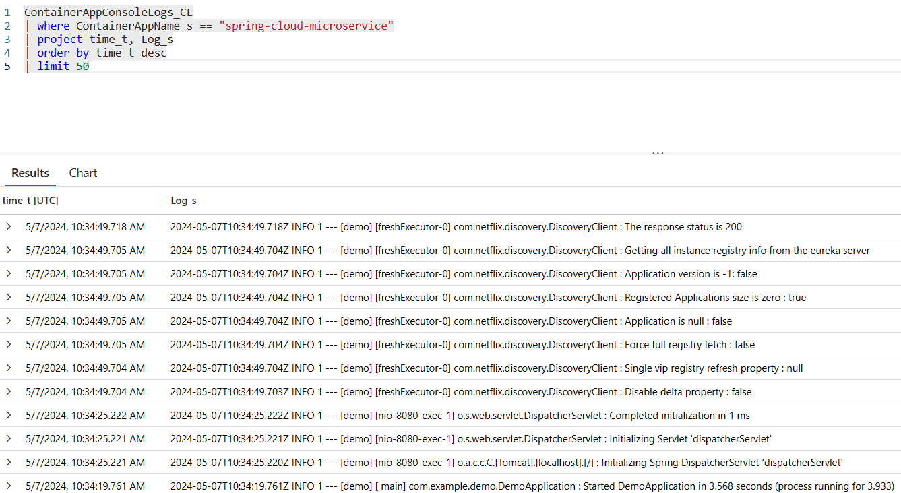

# 04 - Build a Spring Boot microservice using Spring Cloud features

__This guide is part of the [Build, Run and Monitor Intelligent Java Apps on Azure Container Apps and Azure OpenAI](../README.md)__

In this section, we'll build a similar service to the one from section 1, but with the addition of two important Spring Cloud features. First, we'll add this service to Spring Cloud registry for discovery by other services. Second, we'll use Spring Cloud Config to inject a setting from a Git repository into the application and display it on the screen.

---

## What we are going to build

This guide builds upon the previous guides: we are going to build again a simple Spring Boot microservice like in [01 - Build a simple Java application](../01-build-a-simple-java-application/README.md), but this time it will use two major Spring Cloud features:

- It will be connected to a Spring Cloud Service Registry so it can discover other microservices, as well as being discovered itself!

- It will get its configuration from the Spring Cloud Config server that we configured in the previous guide, [02 - Create and configure Managed Config Server for Spring](../02-create-and-configure-managed-config-server-for-spring/README.md)

For both features, it will just be a matter of adding an official Spring Boot starter, and Azure Container Apps and its Java Components will take care of everything else.

## Create a simple Spring Cloud microservice

The microservice that we create in this guide is [available here](spring-cloud-microservice/).

To create our microservice, we will invoke the Spring Initalizer service from the command line:

```bash
curl https://start.spring.io/starter.tgz \
    -d type=maven-project \
    -d dependencies=web,cloud-eureka,cloud-config-client \
    -d baseDir=spring-cloud-microservice \
    -d name=spring-cloud-microservice \
    -d bootVersion=3.2.5 \
    -d javaVersion=17 \
    | tar -xzvf -
```

> This time, we add the `Eureka Discovery Client` and the `Config Client` Spring Boot starters, which will respectively automatically trigger the use of Spring Cloud Eureka Server and Spring Cloud Config Server.

## Add a new Spring MVC Controller

Next to the `SpringCloudMicroserviceApplication` class, create a new class called `HelloController` with the following content:

```java
package com.example.demo;

import org.springframework.beans.factory.annotation.Value;
import org.springframework.web.bind.annotation.GetMapping;
import org.springframework.web.bind.annotation.RestController;

@RestController
public class HelloController {

    @Value("${application.message:Not configured by Spring Cloud Config Server}")
    private String message;

    @GetMapping("/hello")
    public String hello() {
        return message + '\n';
    }
}
```

## Configure Spring Boot

Edit the file `src/main/resources/application.properties` and add the following line:

```properties
spring.config.import=optional:configserver:
```

This line makes using the Spring Cloud Config server optional. This will be useful in development mode (when we won't have a Spring Cloud Config server), and can be removed later in production.

## Test the project locally

Before deploying the microservice to Azure Container Apps, let's run it locally.

>💡 Do not be alarmed when you see exception stack traces:
> 
>Spring Cloud is attempting to contact a local configuration server, which we have not provided. The application will still start using any available local settings and defaults.

To run `simple-cloud-microservice` locally:

```bash
cd spring-cloud-microservice
./mvnw clean package
java -jar target/demo-0.0.1-SNAPSHOT.jar &
cd ..
```

Requesting the `/hello` endpoint should return the "Not configured by Spring Cloud Server" message.

```bash
curl http://127.0.0.1:8080/hello
```

Kill the locally running microservice:

```bash
kill %1
```

## Create and deploy the application on Azure Container Apps

As in [01 - Build a simple Java application](../01-build-a-simple-java-application/README.md), create a specific `spring-cloud-microservice` application:

```bash
cd spring-cloud-microservice
./mvnw clean package
az containerapp create \
    --name spring-cloud-microservice \
    --resource-group $RESOURCE_GROUP \
    --environment $ENVIRONMENT \
    --artifact ./target/demo-0.0.1-SNAPSHOT.jar \
    --min-replicas 1 \
    --ingress external \
    --target-port 8080
cd ..
```

After the application created, update the application to bind with the Managed Eureka Server and the Managed Config Server created in previous sections.

```bash
az containerapp update \
    --name spring-cloud-microservice \
    --resource-group $RESOURCE_GROUP \
    --bind $CONFIG_SERVER_NAME $EUREKA_SERVER_NAME
```

## Test the project in the cloud

Go to [the Azure portal](https://portal.azure.com):

- Look for your container app named as `$APP_NAME` in your resource group named as `$RESOURCE_GROUP`
- Find the "Application Url" in the "Essentials" section

You can now use `curl` again to test the `/hello` endpoint, this time it is served by Azure Container Apps and configured using the Managed Config Server from [03 - Create and configure Managed Config Server for Spring](../03-create-and-configure-managed-config-server-for-spring/README.md).

As a result, requesting the `/hello` endpoint should return the message that we configured in the `application.yml` file, coming from the Spring Cloud Config Server:

```bash
Configured by Managed Config Server for Spring. Configuration file in private repository.
```

> If you are using public repository [https://github.com/Azure-Samples/java-on-aca-sample-public-config.git](https://github.com/Azure-Samples/java-on-aca-sample-public-config.git) to set up the Config Server, you should see `Configured by Managed Config Server for Spring. Configuration file in public repository.`.

## Stream application logs

When you run an application on your machine, you can see its output in the console. When you run a microservice on Azure Container Apps, you can also see its console output through Azure CLI:

```bash
az containerapp logs show --name spring-cloud-microservice --resource-group $RESOURCE_GROUP
```

_Please be aware it might take a couple of seconds for the logs to show up._

You should see the console output of `spring-cloud-microservice` scroll by on your terminal:


From the console output, you can see that the application is successfully registered to the Managed Eureka Server from [02 - Create Managed Eureka Server for Spring](../02-create-and-configure-managed-eureka-server-for-spring/README.md).

## Query application logs

Streaming the console output as we just did may be helpful in understanding the immediate state of a microservice. However, sometimes it's necessary to look further into the past or to look for something specific. This is easily done with Log Analytics. In section 3, we enabled log aggregation in Azure Log Analytics. Such settings changes can take 1-2 minutes to apply, so by now, you should be able to query Azure Log Analytics.

[Open Azure Portal](https://portal.azure.com) and navigate to your container app `spring-cloud-microservice`. Click on "Logs". This is a shortcut to the Log Analytics workspace that was created earlier. If a tutorial appears, feel free to skip it for now.

This workspace allows you to run queries on the aggregated logs. The most common query is to get the latest log from a specific application:

__Important:__ Applications logs have a dedicated `ContainerAppConsoleLogs_CL` type.

Here is how to get its 50 most recent logs of the `ContainerAppConsoleLogs_CL` type for the microservice we just deployed:

Insert this text in the text area that states "Type your queries here or click on of the queries to start".  Click the text of the query, then click "Run".

```sql
ContainerAppConsoleLogs_CL
| where ContainerAppName_s == "spring-cloud-microservice"
| project time_t, Log_s
| order by time_t desc
| limit 50
```



>💡 It can also take 1-2 minutes for the console output of an Azure Container Apps microservice to be read into Log Analytics.

## Conclusion

Congratulations, you have deployed a complete Spring Cloud microservice, using Spring Cloud Eureka Server and Spring Cloud Config Server!

If you need to check your code, the final project is available in the ["spring-cloud-microservice" folder](spring-cloud-microservice/).

---

⬅️ Previous guide: [03 - Create and configure Managed Config Server for Spring](../03-create-and-configure-managed-config-server-for-spring/README.md)

➡️ Next guide: [05 - Build a reactive Spring Boot microservice using Cosmos DB](../05-build-a-reactive-spring-boot-microservice-using-cosmosdb/README.md)
