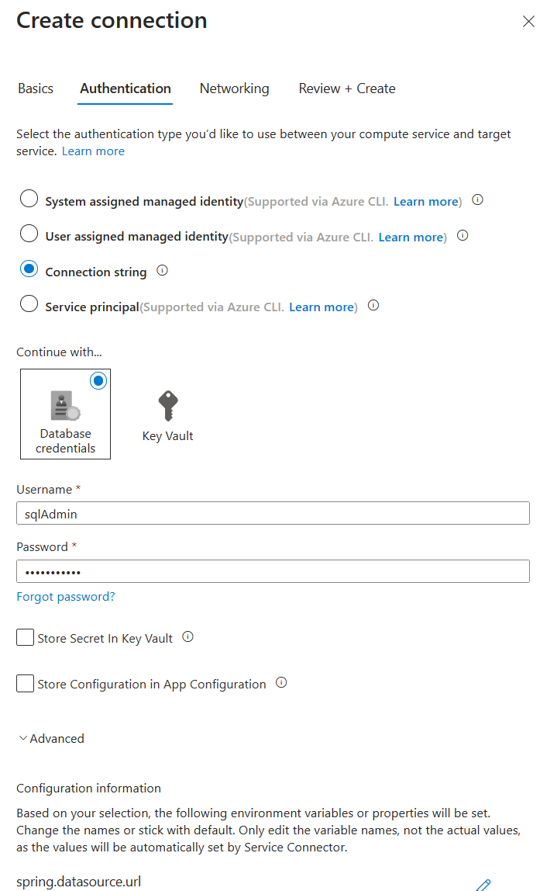
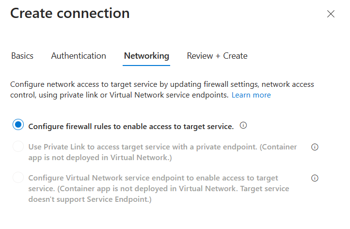
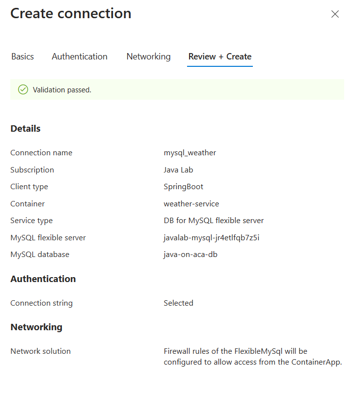

# 06 - Build a Spring Boot microservice using MySQL

__This guide is part of the [Build, Run and Monitor Intelligent Spring Java Apps on Azure Container Apps and Azure OpenAI](../README.md)__

In this section, we'll build another data-driven microservice. This time, we will use a relational database, a [MySQL database managed by Azure](https://docs.microsoft.com/en-us/azure/mysql). And we'll use Java Persistence API (JPA) to access the data in a way that is more frequently used in the Java ecosystem.

---

## Create a Spring Boot microservice

Firstly, let's get the code for `weather-service` ready. The microservice that we create in this guide is [available here](weather-service/).

To create our microservice, we will invoke the Spring Initalizr service from the command line:

```bash
curl https://start.spring.io/starter.tgz \
    -d type=maven-project \
    -d dependencies=web,data-jpa,mysql,cloud-eureka,cloud-config-client \
    -d baseDir=weather-service \
    -d name=weather-service \
    -d bootVersion=3.2.5 \
    -d javaVersion=17 \
    | tar -xzvf -
```

> We use the `Spring Web`, `Spring Data JPA`, `MySQL Driver`, `Eureka Discovery Client` and the `Config Client` components.

## Add Spring code to get the data from the database

Next to the `WeatherServiceApplication` class, create a `Weather` JPA entity:

```java
package com.example.demo;

import jakarta.persistence.Entity;
import jakarta.persistence.Id;

@Entity
public class Weather {

    @Id
    private String city;

    private String description;

    private String icon;

    public String getCity() {
        return city;
    }

    public void setCity(String city) {
        this.city = city;
    }

    public String getDescription() {
        return description;
    }

    public void setDescription(String description) {
        this.description = description;
    }

    public String getIcon() {
        return icon;
    }

    public void setIcon(String icon) {
        this.icon = icon;
    }
}
```

Then, create a Spring Data repository to manage this entity, called `WeatherRepository`:

```java
package com.example.demo;

import org.springframework.data.repository.CrudRepository;

public interface WeatherRepository extends CrudRepository<Weather, String> {
}
```

And finish coding this application by adding a Spring MVC controller called `WeatherController`:

```java
package com.example.demo;

import org.springframework.web.bind.annotation.*;

import java.util.Optional;

@RestController
@RequestMapping("/weather")
public class WeatherController {

    private final WeatherRepository weatherRepository;

    public WeatherController(WeatherRepository weatherRepository) {
        this.weatherRepository = weatherRepository;
    }

    @GetMapping("/city")
    public Optional<Weather> getWeatherForCity(@RequestParam("name") String cityName) {
        return weatherRepository.findById(cityName);
    }
}
```

## Add sample data in MySQL

In order to have Hibernate automatically create your database, open up the `src/main/resources/application.properties` file and add:

```properties
spring.jpa.hibernate.ddl-auto=create
```

Then, in order to have Spring Boot add sample data at startup, create a `src/main/resources/import.sql` file and add:

```sql
INSERT INTO `java-on-aca-db`.`weather` (`city`, `description`, `icon`) VALUES ('Paris, France', 'Very cloudy!', 'weather-fog');
INSERT INTO `java-on-aca-db`.`weather` (`city`, `description`, `icon`) VALUES ('London, UK', 'Quite cloudy', 'weather-pouring');
```

> The icons we are using are the ones from [https://materialdesignicons.com/](https://materialdesignicons.com/) - you can pick their other weather icons if you wish.

## Deploy the application

You can now build your "weather-service" project and send it to Azure Container Apps:

```bash
cd weather-service
./mvnw clean package -DskipTests
az containerapp create \
    --name weather-service \
    --resource-group $RESOURCE_GROUP \
    --environment $ENVIRONMENT \
    --artifact ./target/demo-0.0.1-SNAPSHOT.jar \
    --min-replicas 1 \
    --ingress external \
    --bind $CONFIG_SERVER_NAME $EUREKA_SERVER_NAME \
    --target-port 8080 \
    --query properties.configuration.ingress.fqdn
cd ..
```

## Connect the MySQL database to the application

As we did for Cosmos DB in the previous section, create a Service Connector for the MySQL database to make it available to the `weather-service` microservice.
In the [Azure Portal](https://portal.azure.com):

- Navigate to your container app `weather-service`
    - The container app will show with some issues like "weather-service Container Crashing". That is because we haven't configure the MySQL connection for it. So let's ignore the issue now and move forward.
- Select `Service Connector (preview)` from the left table of contents, and then on `+ Create`
- Populate the Service Connector fields as shown:
  - For Service type, select `DB for MySQL flexible server`
  - Specify a connection name, e.g. "mysql_weather"
  - Verify the correct subscription is shown
  - Choose the MySQL server created in the preceding steps
  - Select the MySQL database created earlier
  - Select `SpringBoot` as the Client type
  - Click the `Next: Authentication` button


- Select `Connection string`
- Select `Continue with...Database credentials` and fill in Username and Password
  - The Username is `sqlAdmin`.
  - The password is the one you specified in section 00. The default value is `super$ecr3t`.
- Expand the `Advanced` tag below to verify the property names injected into the connected app (Optional)
- Click `Next: Networking`



- Verify that `Configure firewall rules to enable access to target service` is selected
- Click on `Next: Review + Create`



- After receiving the "Validation passed" message, click the `Create` button to create the Service Connector



## Test the project in the cloud

- Go to your container app `weather-service`
- Find the "Application Url" in the "Essentials" section

You can now use `curl` to test the `/weather/city` endpoint. For example, to test for `Paris, France` city, append to the end of the test endpoint: `/weather/city?name=Paris%2C%20France`.

```bash
curl https://weather-service.victorioussky-9afe1793.canadacentral.azurecontainerapps.io/weather/city?name=Paris%2C%20France
```

Here is the response you should receive:

```json
{"city":"Paris, France","description":"Very cloudy!","icon":"weather-fog"}
```

If you need to check your code, the final project is available in the ["weather-service" folder](weather-service/).

Same as `city-service`, update the `weather-service` to only accept internal traffic.

```bash
az containerapp ingress update \
    --name weather-service \
    --resource-group $RESOURCE_GROUP \
    --type internal
```

---

⬅️ Previous guide: [05 - Build a reactive Spring Boot microservice using Cosmos DB](../05-build-a-reactive-spring-boot-microservice-using-cosmosdb/README.md)

➡️ Next guide: [07 - Build a Spring Cloud Gateway](../07-build-a-spring-cloud-gateway/README.md)
