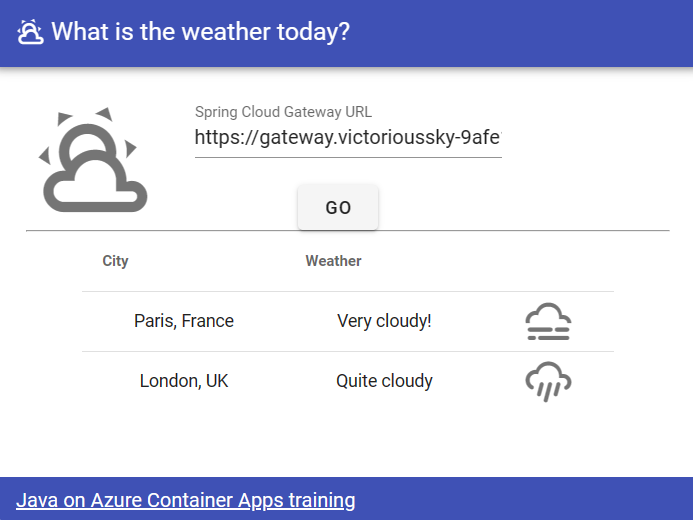

# 08 - Putting it all together, a complete microservice stack

__This guide is part of the [Build, Run and Monitor Intelligent Spring Java Apps on Azure Container Apps and Azure OpenAI](../README.md)__

Now that we have made microservices publicly available, we will incorporate a user interface to see them in action. Then, we will use Azure Monitor to monitor the flow of traffic to and among our services and to track metrics.

---

## Add a front-end to the microservices stack

We now have a complete microservices stack:

- A `gateway` based on Spring Cloud Gateway.
- A reactive `city-service` microservice, that stores its data in Azure Cosmos DB.
- A `weather-service` microservice, that stores its data in MySQL.

In order to finish this architecture, we need to add a front-end to it:

- We've already built a VueJS application, that is available in the ["weather-app" folder](weather-app/).
- This front-end will be hosted on Azure Container Apps as well, with its own domain name. That's why we enabled CORS in our gateway earlier.
- If you are familiar with NodeJS and Vue CLI, you can also run this application locally by typing `npm install && vue ui`.

In order to simplify this part, which is not relevant to understanding Java and Spring, we have already containerized the front-end application and put it in `mcr.microsoft.com/javaaccelerator/samples/weather-app:latest`. You can use it directly.

```bash
az containerapp create \
    --name weather-app \
    --resource-group $RESOURCE_GROUP \
    --environment $ENVIRONMENT \
    --image mcr.microsoft.com/javaaccelerator/samples/weather-app:latest \
    --ingress external \
    --target-port 80
```

After created, find its "Application Url" and open it in your browser. The "Spring Cloud Gateway URL" is automatically populated with your gateway address. Click on "Go" and you should see the following screen:



⬅️ Previous guide: [07 - Build a Spring Cloud Gateway](../07-build-a-spring-cloud-gateway/README.md)

➡️ Next guide: [09 - Build a Spring AI application using Azure OpenAI](../09-build-a-spring-ai-application-using-azure-openai/README.md)
