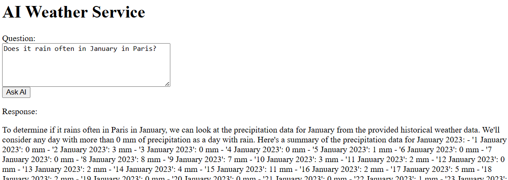
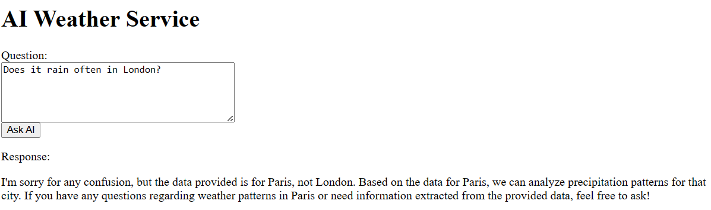

# 09 - Build a Spring AI application using Azure OpenAI

__This guide is part of the [Build, Run and Monitor Intelligent Spring Java Apps on Azure Container Apps and Azure OpenAI](../README.md)__

In this section, we'll build an AI application that uses [Azure OpenAI Service](https://learn.microsoft.com/en-us/azure/ai-services/openai/) in order to analyze and forecast weather based on historical data.

We'll leverage [Spring AI](https://spring.io/projects/spring-ai) framework to communicate with Azure OpenAI Service APIs in this section.

---

## Prepare the Azure OpenAI Service

Firstly, define the following environment variables for use in creating the Azure OpenAI resource:

```bash
AZURE_OPENAI_LOCATION="eastus"
AZURE_OPENAI_NAME="<Azure-OpenAI-resource-name>"
```

> Suggest using location `eastus` or `eastus2` to ensure required model available. It is totally fine that Azure OpenAI resource is created in different location than the location specified in previous sections.

Run the following command to create an Azure OpenAI resource:

```bash
az cognitiveservices account create \
    --name $AZURE_OPENAI_NAME \
    --resource-group $RESOURCE_GROUP \
    --location $AZURE_OPENAI_LOCATION \
    --kind OpenAI \
    --sku s0
```

Deploy a `gpt-35-turbo-16k` model in your Azure OpenAI resource:

```bash
az cognitiveservices account deployment create \
    --name $AZURE_OPENAI_NAME \
    --resource-group $RESOURCE_GROUP \
    --deployment-name gpt-35-turbo-16k \
    --model-name gpt-35-turbo-16k \
    --model-version "0613" \
    --model-format OpenAI \
    --sku Standard \
    --capacity 10
```

> Alternatively you can create a `gpt-4` model by the following command:
>
> ```bash
> az cognitiveservices account deployment create \
>     --name $AZURE_OPENAI_NAME \
>     --resource-group $RESOURCE_GROUP \
>     --deployment-name gpt-4 \
>     --model-name gpt-4 \
>     --model-version "0125-Preview" \
>     --model-format OpenAI \
>     --sku Standard \
>     --capacity 10
> ```

Retrieve the endpoint and key of your Azure OpenAI resource, and store them in environment variables:

```bash
AZURE_OPENAI_ENDPOINT=$(az cognitiveservices account show \
    --name $AZURE_OPENAI_NAME \
    --resource-group $RESOURCE_GROUP \
    --query properties.endpoint \
    --output tsv)
AZURE_OPENAI_KEY=$(az cognitiveservices account keys list \
    --name $AZURE_OPENAI_NAME \
    --resource-group $RESOURCE_GROUP \
    --query key1 \
    --output tsv)
```

## Create a Spring AI application

The application that we create in this guide is [available here](ai-weather-application/).

In an __empty__ directory invoke the Spring Initalizr service from the command line:

```bash
curl https://start.spring.io/starter.tgz \
    -d type=maven-project \
    -d dependencies=web,spring-ai-azure-openai \
    -d baseDir=ai-weather-application \
    -d name=ai-weather-application \
    -d bootVersion=3.2.5 \
    -d javaVersion=17 \
    | tar -xzvf -
```

> We use the `Spring AI Azure OpenAI` Spring Boot starter.

## Add code to communicate with the Azure OpenAI Service

Next to the `AiWeatherApplication` class, create a new `AiWeatherController.java` file that contains the code that will be used to call Azure OpenAPI Service APIs.

```java
package com.example.demo;

import org.springframework.ai.azure.openai.AzureOpenAiChatClient;
import org.springframework.ai.chat.ChatResponse;
import org.springframework.ai.chat.messages.Message;
import org.springframework.ai.chat.messages.UserMessage;
import org.springframework.ai.chat.prompt.Prompt;
import org.springframework.ai.chat.prompt.PromptTemplate;
import org.springframework.ai.chat.prompt.SystemPromptTemplate;
import org.springframework.beans.factory.annotation.Value;
import org.springframework.core.io.Resource;
import org.springframework.web.bind.annotation.PostMapping;
import org.springframework.web.bind.annotation.RequestMapping;
import org.springframework.web.bind.annotation.RequestParam;
import org.springframework.web.bind.annotation.RestController;

import java.time.LocalDate;
import java.util.List;
import java.util.Map;

@RestController
@RequestMapping(path = "/weather")
public class AiWeatherController {

    private final AzureOpenAiChatClient chatClient;

    @Value("classpath:/static/prompt.template")
    private Resource promptTemplate;

    @Value("classpath:/static/Paris.csv")
    private Resource parisWeatherData;

    public AiWeatherController(AzureOpenAiChatClient chatClient) {
        this.chatClient = chatClient;
    }

    @PostMapping("/ask")
    public ChatResponse askAi(@RequestParam String question) {
        PromptTemplate systemMessageTemplate = new SystemPromptTemplate(promptTemplate);
        Message systemMessage = systemMessageTemplate.createMessage(
                Map.of("today", LocalDate.now().toString(),
                        "city", "Paris",
                        "weatherHistory", parisWeatherData));
        Prompt prompt = new Prompt(List.of(systemMessage, new UserMessage(question)));
        return chatClient.call(prompt);
    }

}
```

Create a `prompt.template` file under `src/main/resources/static/` that contains the system prompt message template, which will be used to generate prompt message:

```template
Today is {today}.
You will act as a meteorological expert who helps analyze and forecast weather.
Given the following historical weather (in CSV format with header) of {city} over an entire year, please answer the questions and make predictions.
Don't use any external data.

{weatherHistory}
```

Create a `Paris.csv` file under `src/main/resources/static/` to store historical weather data. You can directly copy from [here](ai-weather-application/src/main/resources/static/Paris.csv).

Then, add the following properties in `src/main/resources/application.properties` to configure the [Spring AI Azure OpenAI Chat properties](https://docs.spring.io/spring-ai/reference/api/clients/azure-openai-chat.html#_chat_properties).

```properties
spring.ai.azure.openai.chat.options.deployment-name=gpt-35-turbo-16k
spring.ai.azure.openai.chat.options.temperature=0
```

> If you created `gpt-4` model in previous step, please configure to be `spring.ai.azure.openai.chat.options.deployment-name=gpt-4` here.

Finally, let's add a `index.html` file under `src/main/resources/static/` to make the interaction more friendly. You can directly copy the content from [here](ai-weather-application/src/main/resources/static/index.html).

## Test the project locally

Before launch the project, let's export environment variables to set Spring AI configuration properties `endpoint` and `api-key` with value retrived in previous step.

```bash
export SPRING_AI_AZURE_OPENAI_ENDPOINT=$AZURE_OPENAI_ENDPOINT
export SPRING_AI_AZURE_OPENAI_API_KEY=$AZURE_OPENAI_KEY
```

Run the project:

```bash
cd ai-weather-application
./mvnw spring-boot:run &
cd ..
```

Now open http://127.0.0.1:8080 in your browser, type some questions into the `Question` prompt box and click `Ask AI` button to get an answer from Azure OpenAI.

For example, "How is the weather there on 10 May 2023?":


"How is the weather there across the whole 2023?":


"Does it rain often in January in Paris?":



And some questions without historical data, for example, "Does it rain often in London?":



Finally, kill running app:

```bash
kill %1
```

## Create the application on Azure Container Apps and test in the cloud

As in [01 - Build a simple Java application](../01-build-a-simple-java-application/README.md), create a specific `ai-weather-application` application in your Azure Container Apps:

```bash
cd ai-weather-application
./mvnw clean package -DskipTests
az containerapp create \
    --name ai-weather-application \
    --resource-group $RESOURCE_GROUP \
    --environment $ENVIRONMENT \
    --artifact ./target/demo-0.0.1-SNAPSHOT.jar \
    --min-replicas 1 \
    --ingress external \
    --target-port 8080 \
    --secrets azureopenaikey=$AZURE_OPENAI_KEY

az containerapp update \
    --name ai-weather-application \
    --resource-group $RESOURCE_GROUP \
    --set-env-vars SPRING_AI_AZURE_OPENAI_ENDPOINT=$AZURE_OPENAI_ENDPOINT \
        SPRING_AI_AZURE_OPENAI_API_KEY=secretref:azureopenaikey
cd ..
```

> In above command, Spring AI configuration properties `SPRING_AI_AZURE_OPENAI_ENDPOINT` and `SPRING_AI_AZURE_OPENAI_API_KEY` are set as Azure Container Apps environment variables.

After created, find its "Application Url" and open it in your browser for testing.

---

⬅️ Previous guide: [08 - Putting it all together, a complete microservice stack](../08-putting-it-all-together-a-complete-microservice-stack/README.md)